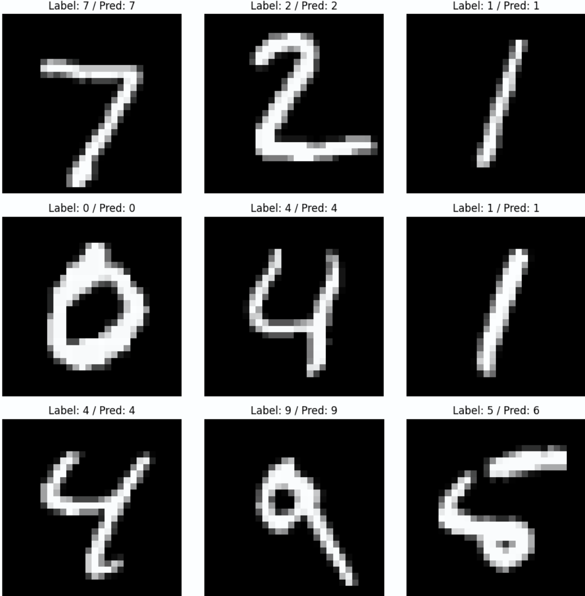

# 🧠 MNIST Classifier with PyTorch

> A journey from scratch to an exported PyTorch model, focused on learning and quality!


## 🚀 About the Project

This project implements a Convolutional Neural Network (CNN) in PyTorch to classify handwritten digits from the popular **MNIST** dataset. It covers the **entire model lifecycle**:

- ✅ Preprocessing and data loading
- ✅ Training and evaluation
- ✅ Exporting to ONNX
- ✅ Metrics analysis and visualization

Additionally, the code is well-organized, documented, and ready for future deployment.

## 📁 Project Structure

```bash
.
├── data_loader.py         # Data loading functions
├── model.py               # Neural network architecture
├── train.py               # Training loop, evaluation, and model saving
├── eval.ipynb             # Post-training metrics analysis
├── teste-img-net.ipynb    # Tests with custom images
├── to_onnx.ipynb          # Exporting the model to ONNX
├── image.png              # Visual prediction example
├── results/               # Metrics saved in CSV
├── checkpoints/           # Saved trained models
```

## 🧠 Model Architecture

```python
Net(
  Conv2d(1, 32, kernel_size=3)
  ReLU
  Conv2d(32, 64, kernel_size=3)
  ReLU
  MaxPool2d(2)
  Flatten
  Linear(9216 -> 128)
  ReLU
  Linear(128 -> 10)
  LogSoftmax
)
```

## 🔧 How to Run

### 1. Clone the repository

```bash
git clone https://github.com/matheuspgamba/mnist-pytorch.git
cd mnist-pytorch
```

### 2. Install dependencies

```bash
pip install torch torchvision matplotlib
```

### 3. Train the model

```bash
python train.py --epochs 5 --batch-size 64 --lr 0.001
```

Results will be automatically saved in `results/metrics.csv` and the best model in `checkpoints/best_model.pth`.

### 4. Evaluation and Export

Use the notebooks:

- 📊 `eval.ipynb` – visualizing training/testing metrics
- 🧪 `teste-img-net.ipynb` – testing with custom images
- 📤 `to_onnx.ipynb` – exporting the trained model to ONNX format

## 🏁 Results

During training, the model reaches an accuracy of **+99%**, with consistent performance and decreasing loss. Here's an example of a saved result:



## 🤖 Technologies Used

- [PyTorch](https://pytorch.org/)
- [Torchvision](https://pytorch.org/vision/stable/)
- [Jupyter Notebook](https://jupyter.org/)
- [ONNX](https://onnx.ai/)

## ✍️ Author

Made with 💻, ☕ and 🤘 by **Matheus Paz Gamba**  
[LinkedIn](https://www.linkedin.com/in/matheusgamba) | [GitHub](https://github.com/matheuspgamba)

---

> “Per aspera ad astra.”
